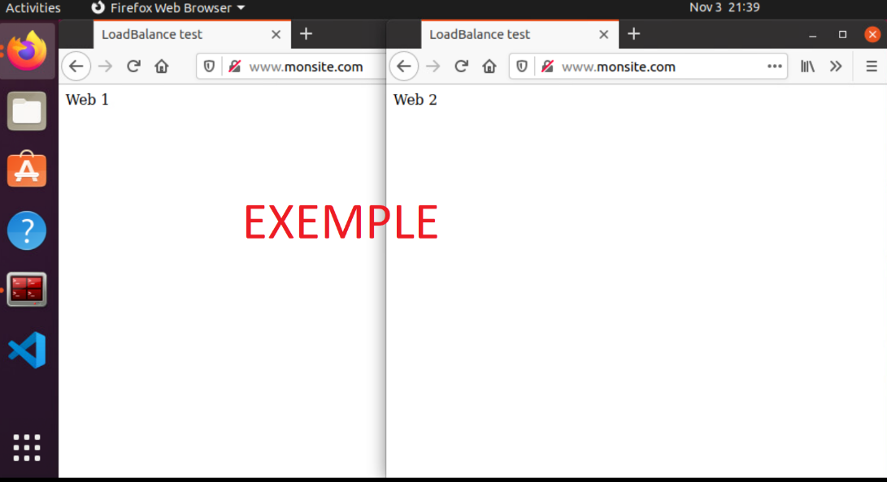

# Exercice 16 – Nginx équilibreur/répartiteur de charge

## Informations

| Critère | Détail |
|---------|---------|
| Évaluation | Formative |
| Type de travail | Individuel |
| Durée | 3 heures |
| Système d'exploitation | Windows, Linux |
| Environnement | Docker |

## Objectifs

L'exercice vise à :

* Réaliser une installation complète d'un site Web avec nginx
* Configurer nginx comme équilibreur/répartiteur de charge (load balancer)

## Description

Dans cet exercice, nous allons mettre en place un site Web complet comprenant :

* Le serveur Web nginx
* PHP
* MySQL (ou MariaDB)

Une attention particulière sera portée sur la configuration de nginx en tant qu'équilibreur de charge (load balancer).

# Partie 1 : Installation complète d'un site Web

Cette partie détaille l'installation du serveur Web nginx selon les spécifications données.

## Étape 1 : Installation

### A. Configuration PHP pour Nginx

Pour activer PHP dans Nginx, nous devons configurer le fichier `default.conf` dans le contexte server :

```nginx
# monsite default.conf
server {
    listen       80;
    listen  [::]:80;
    server_name  monsite.com www.monsite.com;

    #access_log  /var/log/nginx/host.access.log  main;

    root   /usr/share/nginx/html;
    index  index.php index.html index.htm;

    location / {
        try_files $uri $uri/ /index.php?$query_string;
    }

    #error_page  404              /404.html;

    # redirect server error pages to the static page /50x.html
    error_page   500 502 503 504  /50x.html;
    location = /50x.html {
        root   /usr/share/nginx/html;
    }
    
    # PHP-FPM Configuration pour php
    location ~\.php$ {
        try_files $uri = 404;
        fastcgi_split_path_info ^(.+\.php)(/.+)$;
        fastcgi_pass php:9000;
        fastcgi_index index.php;
        include fastcgi_params;
        fastcgi_param REQUEST_URI $request_uri;
        fastcgi_param SCRIPT_FILENAME $document_root$fastcgi_script_name;
        fastcgi_param PATH_INFO $fastcgi_path_info;
    }

    # deny access to .htaccess files
    #location ~ /\.ht {
    #    deny  all;
    #}
}
```

### B. Spécifications du site Web

**Fichiers requis :**
- Utiliser le fichier `index.php` d'un exercice précédent pour les tests

**Configuration des services :**

1. **Nginx :**
   - Image : nginx:alpine
   - Port : 80
   - Conserver les logs par défaut
   - Conserver l'emplacement racine (/) par défaut
   - Mappage : monsite/conf → /etc/nginx/conf.d

2. **PHP :**
   - Créer un Dockerfile personnalisé
   - Mettre à jour PHP
   - Installer l'extension mysqli

3. **MySQL/MariaDB :**
   - Configurer le redémarrage automatique
   - Créer un volume persistant `dbdata`

**Structure des fichiers :**
```
/SiteWeb/
|--docker-compose.yml
|--monsite/
|  |--conf/
|     |--default.conf
|  |--html/
|     |--index.php
|--php/
   |--Dockerfile
```

### C. Test du site

Vérifier le bon fonctionnement du site Web après l'installation.

### D. Arrêt du système

Procéder à l'arrêt propre du système une fois les tests terminés.

# Partie 2 : Load Balancer

Cette partie traite de la configuration de nginx comme équilibreur de charge entre deux serveurs. NGINX peut servir non seulement de serveur Web et de cache, mais également d'équilibreur de charge avec une configuration flexible.

## Étape 1 : Création de la structure

### A. Structure des fichiers

Créez l'arborescence suivante sous le répertoire Dev :

```
/LoadBalancer/
├── docker-compose.yml
├── nginx/
│   └── default.conf     # fichier vide initialement
├── web1/
│   └── html/
│       └── index.html
└── web2/
    └── html/
        └── index.html
```

### B. Architecture du système

La configuration permettra à nginx de rediriger le trafic pour www.monsite.com vers deux serveurs Apache (httpd) en mode round robin :

```
                       |-- web1 (httpd)
www.monsite.com── nginx|
                       |-- web2 (httpd)
```

### C. Configuration des pages

Pour visualiser la répartition de charge entre les deux serveurs Apache, créez deux pages `index.html` distinctes pour chaque serveur.

# Étape 2 : Configuration

## A. Configuration du module Upstream

Le module upstream de nginx permet de créer un groupe nommé de serveurs. Voici la configuration à placer dans le contexte http du fichier `default.conf` :

```nginx
upstream monsite-servers {
    server web1 max_fails=2;
    server web2 max_fails=2;
}
```

## B. Configuration du Virtual Host

Dans le contexte server du fichier `default.conf`, configurez la redirection du trafic en round robin :

```nginx
server {
    listen 80;
    server_name monsite.com www.monsite.com;

    location / {
        proxy_pass         http://monsite-servers;
        proxy_redirect     off;
        proxy_set_header   Host $host;
        proxy_set_header   X-Real-IP $remote_addr;
        proxy_set_header   X-Forwarded-For $proxy_add_x_forwarded_for;
        proxy_set_header   X-Forwarded-Host $server_name;
    }
}
```

## C. Directives Proxy

Les directives proxy_ servent à :
- `proxy_pass` : Définit l'adresse du serveur proxy
- `proxy_redirect` : Contrôle la réécriture des en-têtes Location et Refresh
- `proxy_set_header Host` : Définit le nom d'hôte pour le serveur proxifié
- `proxy_set_header X-Real-IP` : Transmet l'IP réelle du client
- `proxy_set_header X-Forwarded-For` : Conserve la chaîne des adresses IP
- `proxy_set_header X-Forwarded-Host` : Transmet le nom d'hôte original

## D. Configuration Docker Compose

```yaml
version: '3'

services:
  proxy:
    image: nginx:alpine
    ports:
      - '80:80'
    volumes:
      - ./nginx/default.conf:/etc/nginx/conf.d/default.conf:ro
  web1:
    image: httpd:alpine
    volumes:
      - ./web1/html:/usr/local/apache2/htdocs/
  web2:
    image: httpd:alpine
    volumes:
      - ./web2/html:/usr/local/apache2/htdocs/
```

## E. Test et Vérification

1. Lancez les conteneurs :
```bash
docker compose up -d
```

2. Testez l'équilibrage en rafraîchissant la page plusieurs fois.

## F. Liaison entre Conteneurs

La résolution des noms `web1` et `web2` dans la clause upstream fonctionne grâce au DNS intégré de Docker. Docker Compose crée automatiquement un réseau où les services peuvent se référencer par leur nom.

## G. Nettoyage

Pour arrêter et supprimer les conteneurs :
```bash
docker compose down
```

# Vérification

## Capture d'écran requise

Fournir une capture d'écran de Linux montrant :
- Deux fenêtres Firefox ouvertes
- Chacune affichant www.monsite.com
- Démontrant les deux retours différents du load balancer





## Compétences développées

| Code | Description | Détail |
|------|-------------|---------|
| 00SJ | Déploiement de serveurs intranet | #1 Analyse du projet de déploiement |
| | | #2 Montage des serveurs intranet |
| | | #3 Installation des services intranet |
| | | #5 Participation à la mise en service |

*Note : Ces compétences sont développées partiellement*

## Références

* Documentation officielle Nginx
  - https://nginx.org/en/docs/
  - https://docs.nginx.com/nginx/admin-guide/
  - https://nginx.org/en/docs/http/load_balancing.html
  - https://nginx.org/en/docs/http/ngx_http_proxy_module.html

* Ressources Docker
  - https://hub.docker.com/_/nginx

* Tutoriels
  - https://adoltech.com/blog/how-to-set-up-nginx-php-fpm-and-mysql-with-docker-compose/

